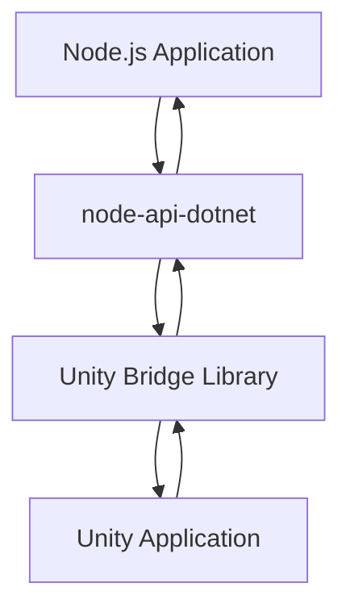
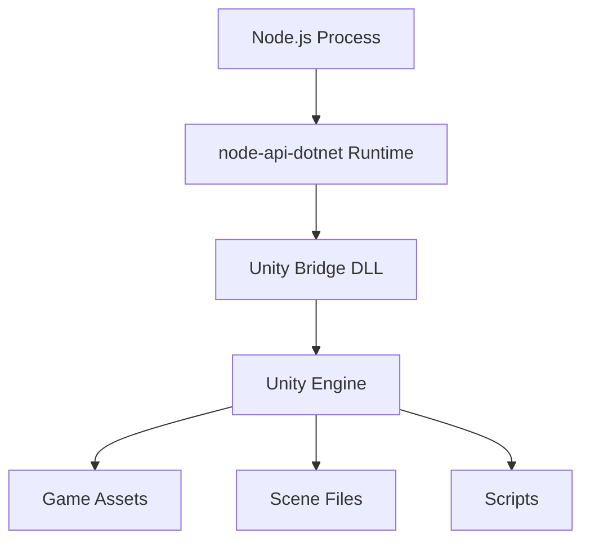

# Unity-Node.js Communication Bridge Design

## Overview
This document describes the architecture for enabling communication between Node.js and Unity applications using the node-api-dotnet project. The solution allows Node.js to call Unity methods for controlling Unity application behavior.

## Architecture

### Components

1. **Unity Application**
   - Contains game logic and 3D rendering engine
   - Exposes C# APIs for external control
   - Runs as a standalone application or in editor mode

2. **Unity Bridge Library**
   - Custom C# library within Unity project
   - Uses [JSExport] attributes to expose methods to Node.js
   - Handles communication between Unity's internal systems and external calls

3. **node-api-dotnet Runtime**
   - Enables .NET code execution within Node.js process
   - Loads Unity Bridge Library as a Node.js module
   - Marshals data between JavaScript and C# types

4. **Node.js Application**
   - JavaScript code that controls Unity behavior
   - Loads Unity Bridge Library through node-api-dotnet
   - Calls exported Unity methods

### Data Flow



## Implementation Details

### Unity Bridge Library

The Unity Bridge Library is a C# class library that:
1. References Unity's scripting API
2. Uses [JSExport] attributes to expose methods to Node.js
3. Handles marshalling of data between Unity and Node.js
4. Provides a clean API for controlling Unity behavior

Example structure:
```csharp
[JSExport]
public static class UnityBridge
{
    public static void LoadScene(string sceneName)
    {
        // Unity code to load a scene
        SceneManager.LoadScene(sceneName);
    }
    
    public static void MoveObject(string objectName, float x, float y, float z)
    {
        // Unity code to move a GameObject
        GameObject obj = GameObject.Find(objectName);
        if (obj != null)
        {
            obj.transform.position = new Vector3(x, y, z);
        }
    }
    
    public static string GetObjectPosition(string objectName)
    {
        // Unity code to get a GameObject's position
        GameObject obj = GameObject.Find(objectName);
        if (obj != null)
        {
            Vector3 pos = obj.transform.position;
            return $"{pos.x},{pos.y},{pos.z}";
        }
        return "Object not found";
    }
}
```

### Node.js Integration

In Node.js, the Unity Bridge Library is loaded as a module:
```javascript
const unity = require('node-api-dotnet').require('./path/to/UnityBridge.dll');

// Call Unity methods
unity.LoadScene('MainScene');
unity.MoveObject('Player', 10, 0, 5);
const position = unity.GetObjectPosition('Player');
```

## Communication Patterns

### 1. Direct Method Calls
- Node.js directly calls methods exposed by the Unity Bridge
- Synchronous or asynchronous execution
- Immediate response with return values

### 2. Event-Based Communication
- Unity can send events to Node.js
- Node.js can listen for Unity events
- Enables reactive programming patterns

### 3. Data Streaming
- Continuous data transfer between Unity and Node.js
- Suitable for real-time telemetry or sensor data
- Uses callbacks or promises for handling streams

## Deployment Architecture



## Security Considerations

1. **Input Validation**
   - All inputs from Node.js should be validated before processing in Unity
   - Prevent malicious code injection through method parameters

2. **Access Control**
   - Limit which Unity methods can be called from Node.js
   - Implement authentication for sensitive operations

3. **Error Handling**
   - Graceful error handling for communication failures
   - Logging of all interactions for debugging

## Performance Considerations

1. **Marshalling Overhead**
   - Minimize data conversion between JavaScript and C#
   - Use efficient data structures for large data transfers

2. **Threading**
   - Ensure thread safety when calling Unity methods from Node.js
   - Use Unity's main thread for UI and rendering operations

3. **Memory Management**
   - Proper disposal of resources
   - Avoid memory leaks in long-running applications

## Development Workflow

1. **Setup**
   - Install Unity 2023 with required components
   - Install Node.js and node-api-dotnet package
   - Configure project references

2. **Development**
   - Implement Unity Bridge methods with [JSExport]
   - Write Node.js code to call Unity methods
   - Test integration with both systems running

3. **Deployment**
   - Package Unity application as standalone executable
   - Distribute Node.js application with Unity Bridge DLL
   - Ensure compatible .NET runtime versions

## Future Enhancements

1. **Bidirectional Communication**
   - Enable Unity to call Node.js methods
   - Implement callback mechanisms

2. **Real-time Data Synchronization**
   - Synchronize game state between Unity and Node.js
   - Implement conflict resolution strategies

3. **Distributed Architecture**
   - Support multiple Unity instances
   - Enable networked communication between instances

## Conclusion

This architecture provides a robust foundation for integrating Node.js with Unity applications. By leveraging the node-api-dotnet project, we can create a seamless bridge between the JavaScript and C# ecosystems, enabling powerful new capabilities for Unity developers.